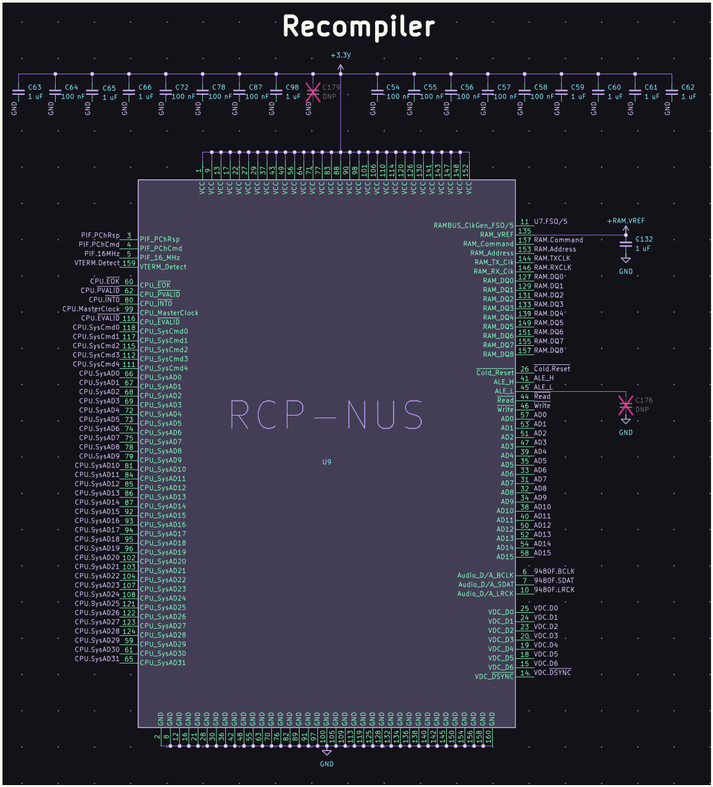
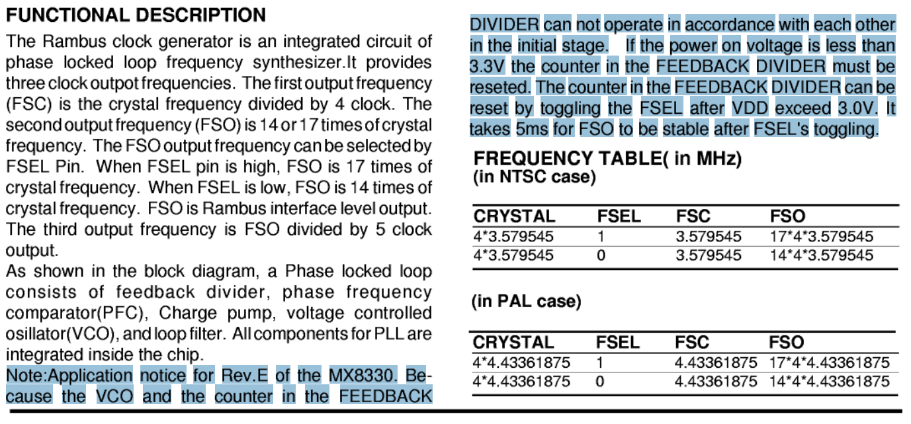
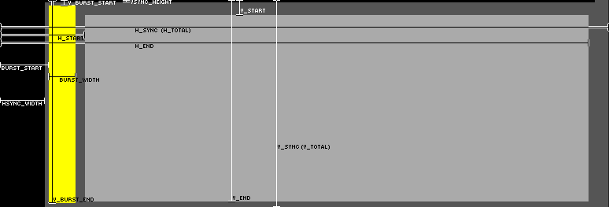
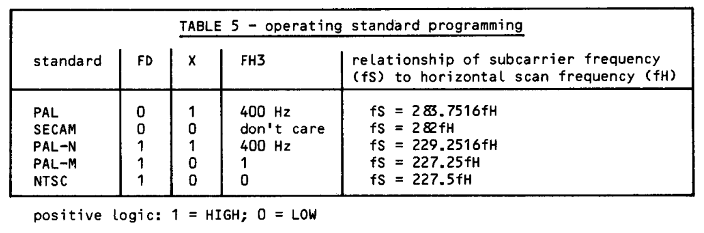

# N64 Refresh Rate Reference

Reference for Nintendo 64 video refresh rates and timing specifications across all supported video modes. Vertical scan frequency (often colloquially termed 'refresh rate') defines the period of the vertical synchronization cycle.  

---

## 1. Introduction

The Nintendo 64 Video Interface (VI) supports three television standards (NTSC, PAL, and PAL-M), each with both progressive and interlaced scan modes, resulting in six video timing configurations. This document provides exact timing values derived from hardware specifications, with all refresh rates expressed as irreducible fractions and high-precision decimals.  

Video Modes:

* NTSC: North America, Japan, South Korea, parts of Central America and the Caribbean  
* PAL: Europe, Australia, New Zealand, parts of Africa and Asia  
* PAL-M: Brazil  

Scan Types:

* Progressive (P): 526 half-lines counted sequentially per frame (PAL: 626)  
* Interlaced (I): 525 half-lines per field, alternating odd/even (PAL: 625)  

### 1.1 Terminology

Vertical scan frequency (fV) defines the interval of the vertical synchronization (VSYNC) signal. fV is measured from the leading edge of a VSYNC pulse to the leading edge of the next. Where used in this document, "refresh rate" refers to this value.  

* In progressive modes, this represents **frame** frequency.  
* In interlaced modes, this represents **field** frequency.  

All values are derived from the system's Master Clock (f_xtal) and the Video Interface (VI) divisor logic.  

### 1.2 Annotations

Parenthetical annotations clarify numerical representations:  

(exact): No rounding error; value derived from integer ratios  
(reduced): Common factors cancelled  
(canonical value): Fully reduced fraction; reference value at full precision  
(≈): Approximate decimal representation   

### 1.3 Distinctions and Hazards

#### Counting Units  
- Half-line is the atomic unit for VI registers.  
- Line (or scanline) equals 2 half-lines. Progressive counts sequentially; interlaced alternates odd/even per field.  

#### Registers  
| Register | Terminal Count | Effective Value |
|----------|----------------|----------------|
| `VI_V_SYNC_REG` | Half-lines per frame | Effective Value = REG + 1 |
| `VI_H_SYNC_REG` | VI clocks per full scanline | Effective Value = REG + 1 |
| `VI_V_CURRENT_LINE_REG` | Current half-line | Increments once per half-line |

#### Modes  
- Progressive: lines per vertical refresh = total half-lines ÷ 2  
- Interlaced: lines per field = total half-lines ÷ 2  
- Interlaced VSYNC offsets 0.5 lines per field automatically

#### Hazards  
- Registers are terminal-counted; add 1 when deriving effective counts.  
- Half-line vs full line must be accounted for.  
- PAL-M differs from PAL; verify VI clocks per line (L).  
- LEAP and hardware jitter affect duration of individual half-lines but do not change nominal half-line count.  
 
---

## 2. Refresh Rate Summary

The table lists refresh rates for all video modes. Reduced fractions indicated below serve as reference for the remainder of this text.  

| Mode | Scan Type   | Refresh Rate (Hz)       | Refresh Rate (Hz) (.10f) |
| :--- | :---        | :---                    | :---          |
| NTSC | Progressive | 2,250,000 / 37,609      | 59.8261054535 |
| NTSC | Interlaced  | 60,000 / 1,001          | 59.9400599401 |
| PAL  | Progressive | 15,625 / 313            | 49.9201277955 |
| PAL  | Interlaced  | 50 / 1                  | 50 (exact)    |
| PAL-M| Progressive | 243,141,548 / 4,064,665 | 59.8183486216 |
| PAL-M| Interlaced  | 486,283,096 / 8,113,875 | 59.9322883333 |

*Progressive: lines per frame = (total half-lines ÷ 2)*  
*Interlaced: lines per field = (total half-lines ÷ 2)*  

> Note: These values correspond to the derivations in §6.  

---

## 3. Technical Specifications

Hardware constants and register mapping for implementing video timings.

### 3.1 Fundamental Constants

Hardware-defined values derived from the system's crystal oscillators and the Video Interface (VI) register logic.

| Mode              | Crystal Frequency (f_xtal) | Multiplier (M) | VI Clocks / Line (L) | Half-Lines (S) | `VI_V_SYNC_REG` |
| :---              | :---                       | :---           | :---                 | :---          | :---        |
| NTSC Progressive  | 14.3181818182 MHz          | 17 / 5         | 3094                 | 526           | `0x20D`     |
| NTSC Interlaced   | 14.3181818182 MHz          | 17 / 5         | 3094                 | 525           | `0x20C`     |
| PAL Progressive   | 17.734475 MHz (exact)      | 14 / 5         | 3178                 | 626           | `0x271`     |
| PAL Interlaced    | 17.734475 MHz (exact)      | 14 / 5         | 3178                 | 625           | `0x270`     |
| PAL-M Progressive | 14.302444 MHz (exact)      | 17 / 5         | 3091                 | 526           | `0x20D`     |
| PAL-M Interlaced  | 14.302444 MHz (exact)      | 17 / 5         | 3091                 | 525           | `0x20C`     |

  
*N64 Clock Generation Circuits – U7 (NTSC/PAL-M) & U15 (PAL). Source: RWeick, NUS-CPU-03-Nintendo-64-Motherboard*  

> Note: Later N64 revisions used Macronix Part No. MX8350 instead of Part No. MX8330MC (see 3.1.1)

* NTSC Clock Precision: 315/22 MHz (exact) (≈ 14.3181818182 MHz)
* PAL Clock Precision: 17,734,475 Hz (exact) = 17.734475 MHz

#### 3.1.1 Clock Generator Hardware Revisions

Early revisions (NUS-CPU-01 through NUS-CPU-07, 1996–1998) used two separate MX8330MC chips: U7 (NTSC/PAL-M) with FSEL tied high → 17/5 multiplier, and U15 (PAL) with FSEL tied low → 14/5 multiplier. Later revisions (NUS-CPU-08 onward, 1999+) consolidated these into a single MX8350 dual-channel chip with equivalent output frequencies and timing characteristics.

  
*MX8350 (later revisions) output frequencies for NTSC/PAL/MPAL. Source: MX8350 datasheet*

> Note: The MX8350 datasheet lists the MPAL crystal as 14.302446 MHz. This document uses 14.302444 MHz (= 4 × 3,575,611 Hz), derived from the color burst frequency upward. This 2 Hz discrepancy may reflect a rounding error in primary sources; all derivations in this document use the color-burst-derived value for internal consistency.

### 3.2 Video Interface (VI) Register Mapping

The RCP (Reality Co-Processor) processes video timings through the following memory-mapped I/O (MMIO) registers:

  
*RCP-NUS VDC pinout & timing signals. Source: RWeick, NUS-CPU-03-Nintendo-64-Motherboard, [github.com](https://github.com/RWeick/NUS-CPU-03-Nintendo-64-Motherboard)*

  
*VDC pin assignments – 7-bit digital output. Source: RWeick, NUS-CPU-03-Nintendo-64-Motherboard, [github.com](https://github.com/RWeick/NUS-CPU-03-Nintendo-64-Motherboard)*

The VDC bus carries:
- `VDC_D0` through `VDC_D6`: 7-bit digital video data
- `VDC_DSYNC`: Combined vertical/field synchronization pulse

These signals are transmitted to the VDC-NUS (BU9801F, U4), which performs 
digital-to-analog conversion and generates CSYNC and BFP for the downstream 
ENC-NUS encoder (U5). This two-stage signal path applies to NUS-CPU-01 through 
NUS-CPU-04; later revisions integrate both functions into a single chip with no 
effect on the timing values derived in this document.  

> VI registers operate on terminal counts; all derived timing values use the canonical half-line model described in §1.

* `VI_V_SYNC_REG` (`0x0440000C`): The register stores a terminal half-line count; the effective number of half-lines per frame equals `VI_V_SYNC_REG` + 1.  
* `VI_H_SYNC_REG` (`0x04400008`): The register stores a terminal VI clock count (per full scanline); the effective clocks per line equal `VI_H_SYNC_REG` + 1.  
* `VI_V_CURRENT_LINE_REG` (`0x04400010`): Reports the current half-line count; increments once per half-line.

*Progressive: counts all half-lines sequentially → lines per vertical refresh = total half-lines ÷ 2.*  
*Interlaced: counts alternating half-lines per field → lines per field = total half-lines ÷ 2.*  
*Effective VSYNC period = total half-lines ÷ 2 (for progressive) or ÷ 2 (per field, for interlaced). This matches the frame frequency for progressive modes and the field frequency for interlaced modes.*  

> For interlaced modes, S is set to an odd integer (525 or 625). The VI hardware automatically offsets the VSYNC pulse (`VDC_DSYNC`) by 0.5 lines every other field.

### 3.3 Derived Timing Values

All values calculated from the fundamental constants above. Line frequencies and refresh rates are expressed as exact fractions (fully reduced) with corresponding decimal representations.

| Mode | Line Frequency (Hz) (.10f) | Line Frequency (Hz) | Progressive Refresh (Hz) | Interlaced Refresh (Hz) |
| :--- | :--- | :--- | :--- | :--- |
| NTSC | 15,734.2657342657 Hz | 2250000/143 | 2250000/37609 | 60000/1001 |
| PAL | 15,625 Hz (exact) | 15625/1 | 15625/313 | 50/1 |
| PAL-M | 15,732.2256874798 Hz | 243141548/15455 | 243141548/4064665 | 486283096/8113875 |

### 3.4 Hardware Signal Path

The generation of video timing follows a deterministic path from physical oscillation to digital counting and finally analog conversion. The following applies to NUS-CPU-01 through NUS-CPU-04, as documented in RWeick's NUS-CPU-03 schematics.  

1. Source: The MX8330MC Clock Generator (U7/U15) utilizes a crystal oscillator (X1/X2) to produce the Master Clock (f_xtal).  
2. Logic: The RCP (Reality Co-Processor, U9) receives a pre-multiplied clock from the synthesizer to drive the internal Video Interface (VI) logic.  
3. Counting: The VI hardware counts cycles based on values stored in `VI_H_SYNC_REG` (Line Length) and `VI_V_SYNC_REG` (Frame Height).  
4. Trigger: Upon reaching the defined count, the RCP asserts `VDC_DSYNC` on pin 14.  
5. Output: The VDC-NUS (BU9801F, U4) receives `VDC_DSYNC` on pin 10 along with digital video data, generates analog RGB, CSYNC, and BFP, and passes these to the ENC-NUS (U5) for final composite and S-Video encoding.  

### 3.5 NTSC Progressive Verification Sample

Expected register values and physical pin mappings (NUS-CPU-01 through NUS-CPU-04; based on RWeick NUS-CPU-03 schematics). Later revisions integrate VDC and encoder functions into a single chip with no effect on the timing values derived in this document.  

| Target Parameter | Register | Value | Result | RCP-NUS (U9) Pin | VDC-NUS (U4) Pin |
| :--- | :--- | :--- | :--- | :--- | :--- |
| Half-Lines (S) | `VI_V_SYNC_REG` | `0x20D` | 526 Lines | — | — |
| Line Duration (L) | `VI_H_SYNC_REG` | `0xC15` | 3094 Clocks | — | — |
| VSYNC/DSYNC Pulse | `VDC_DSYNC` | — | — | Pin 14 (out) | Pin 10 (in) |
| Composite Sync | `CSYNC` | — | — | — | Pin 14 (out) |
| Burst Flag Pulse | `BFP` | — | — | — | Pin 13 (out) |

### 3.6 Diagnostics

Nintendo diagnostic procedures (D.C.N. NUS-06-0014-001A) specify the following oscilloscope verification points for clock signal integrity:

| Signal | Component | Pin | Expected Frequency | Expected Amplitude |
| :--- | :--- | :--- | :--- | :--- |
| NTSC Color Subcarrier (FSC) | U7 | 8 | 3.58 MHz | 3.0 Vpp |
| NTSC Video Clock (VCLK) | U7 | 1 | 48.68 MHz | 3.3 Vpp |
| PAL Video Clock (VCLK) | U15 | 1 | 49.66 MHz | 3.3 Vpp |
| Master Clock | U10 | 16 | 62.51 MHz | — |
| Rambus Clock (RCLK) | U1 | 5 | 250.2 MHz | — |

> Note: The service manual documents a 13-step startup sequence (IPL1→IPL2→IPL3) that initializes the VI timing registers. See official documentation for complete boot diagnostics.

### 3.7 Physical Variance and Environmental Stability

§6 presents a theoretical ideal, but actual hardware performance is influenced by the Macronix MX8330MC and MX8350 clock synthesizers.  

  
*MX8330MC Rev. E application notice illustrating feedback divider stabilization and startup transient.*  

* Thermal drift occurs because the N64’s internal crystal (X1) is physically coupled to the motherboard near the central heatsink. In typical high-temperature conditions (70°C to 80°C / 158°F to 176°F), frequency can vary roughly +/- 50 to 100 ppm, resulting in a fluctuation of approximately 0.003 to 0.006 Hz.  
* Phase-locked loop (PLL) jitter adds short-term variation. The VCO exhibits typical short-term jitter around 150 ps, so while the average refresh rate remains stable, individual scanline durations vary slightly at the picosecond level.  
* Initialization transient affects early timing stability. The MX8330MC Rev. E application notice describes startup conditions in which the VCO and feedback divider may not operate synchronously until the divider is reset and the supply voltage exceeds the nominal operating level. The document also notes a stabilization interval of up to approximately 5 ms before the synthesized clock output reaches steady operation. This interval occurs prior to active video output during the 13-step startup sequence (IPL), when the VI registers and clock generator are initialized.

---

## 4. Signal Analysis

Detailed per-mode timing specifications and hardware implementation notes.

### 4.1 Signal Parameters by Mode

The following table defines the relationship between the hardware's Master Clock (f_vi) and the resulting display timing.

| Mode | Master Clock (f_vi) | Clocks / Line (L) | Half-Lines (S) | Refresh Rate (fV) |
| :--- | :--- | :--- | :--- | :--- |
| NTSC-P | 48.6818181818 MHz | 3094 | 526 | 59.8261054535 Hz |
| NTSC-I | 48.6818181818 MHz | 3094 | 525 | 59.9400599401 Hz |
| PAL-P | 49.65653 MHz (exact) | 3178 | 626 | 49.9201277955 Hz |
| PAL-I | 49.65653 MHz (exact) | 3178 | 625 | 50 Hz (exact) |
| PAL-M-P | 48.6283096000 MHz | 3091 | 526 | 59.8183486216 Hz |
| PAL-M-I | 48.6283096000 MHz | 3091 | 525 | 59.9322883333 Hz |

Note: The Master Clock for PAL-M is derived as exactly 243,141,548 / 5 Hz. The slight deviation in NTSC-equivalent timing (approx. 0.013%) is a hardware constraint caused by the requirement of an integer value for the Clocks / Line (L) register.

#### 4.1.1 Timing Map

Figure 3 is a visualization created by lidnariq after thorough oscilloscope analysis of N64 video output. The image dimensions map to signal timing for one NTSC progressive frame:

  
*N64 VI Timing Diagram (NTSC Progressive). Source: lidnariq / ares emulator Discord, hardware probe*

* Vertical Axis (263 pixels): Represents a single progressive vertical refresh. 263 sequential lines are drawn before VSYNC, returning the electron beam to the top-left of the raster. Lines are contiguous, with no interleaving.  
*Raster: the ordered sequence of horizontal scan lines that constitute a frame in temporal drawing order.*

* Horizontal Axis (774 pixels): Represents VI clocks divided by 4 (≈ VI pixels). Each horizontal pixel corresponds to the activity during that portion of the scanline. The width of 774 corresponds to 3094 VI clocks ÷ 4 ≈ 773.5.

Notes:
* Canvas (V_SYNC/H_SYNC): `VI_V_SYNC_REG` and `VI_H_SYNC_REG` define the limits of the signal.
* Yellow (Color Burst): Visualizes the `VI_BURST_REG` values. Proper configuration ensures this burst gate does not overlap with active video start (`H_START`), preventing color-sync artifacts.
* Grey (Active Area): The region where pixels are fetched from the framebuffer, defined by start/end offsets in `VI_H_VIDEO_REG` and `VI_V_VIDEO_REG`.

### 4.2 Mode-Specific Notes

NTSC (Progressive and Interlaced)

* Crystal frequency: 14.3181818182 MHz (315/22 MHz)
* VI clock frequency: 48.6818181818 MHz (exact) (5355/110 MHz) 
* Color subcarrier: 3.5795454545 MHz (315/88 MHz)
* VI clock multiplier: 17/5 (3.4)
* LEAP register: Not used ( `0x00` )

PAL (Progressive and Interlaced)

* Crystal frequency: 17,734,475 Hz (exact)
* VI clock frequency: 49,656,530 Hz (exact)
* Color subcarrier: 4,433,618.75 Hz (exact) (17,734,475/4 Hz)
* VI clock multiplier: 14/5 (2.8)
* LEAP register: Used to maintain exact 15625 Hz line frequency
* LEAP pattern: 5-field sequence (B-A-B-A-B) adds fractional VI clocks (6-5-6-5-6 pattern)
* Color Phase: Maintains the Bruch Phase (PAL switch); the V-component of the color subcarrier inverts on alternate lines via f_xtal synchronization.

PAL-M (Progressive and Interlaced)

* Crystal frequency: 14,302,444 Hz (exact)
* VI clock frequency: 48,628,309.6 Hz (exact) (243,141,548 / 5 Hz)
* Color subcarrier: 3,575,611 Hz (exact)
* VI clock multiplier: 17 / 5 (3.4)

Notes:  
* To match the NTSC standard line rate (approx. 15,734.265 Hz) exactly, the VI would require 3,090.589 clocks per line. Since the VI hardware utilizes integer counting for line duration, it employs the nearest integer (3091). This results in a line frequency of approx. 15,732.23 Hz, a deviation of ~0.013% from NTSC nominal ~15,734.265 Hz.
* LEAP register: Not used (`0x00`).

#### 4.2.1 Subcarrier Frequency Relationships

All N64 video modes adhere to broadcast standard relationships between subcarrier frequency (fS) and horizontal scan frequency (fH):

  
*Standard fS to fH ratios. Source: Wooding, The Amateur TV Compendium, p. 55*

| Mode  | Relationship            | Verification                                  |
| :---- | :---------------------  | :-------------------------------------------- |
| NTSC  | fS = 227.5 × fH         | 3,579,545.45... Hz = 227.5 × 15,734.26... Hz  |
| PAL   | fS = (283.75 × fH) + 25 | 4,433,618.75 Hz = (283.75 × 15,625) + 25      |
| PAL-M | fS = 227.25 × fH        | 3,575,611 Hz ≠ 227.25 × 15,732.22... Hz (actual ratio: 15,455/68 ≈ 227.279; see §4.2) |

---

## 5. Refresh Rate Conversion Tables

To convert from one mode to another, multiply the source refresh rate by the conversion factor.

### 5.1 Decimal Conversions

Factors rounded to 5 decimal places for practical use.

| From \ To | NTSC-P | NTSC-I | PAL-P | PAL-I | PAL-M-P | PAL-M-I |
| --- | --- | --- | --- | --- | --- | --- |
| NTSC-P | 1.00000 | 1.00190 | 0.83442 | 0.83576 | 0.99987 | 1.00177 |
| NTSC-I | 0.99810 | 1.00000 | 0.83283 | 0.83417 | 0.99797 | 0.99987 |
| PAL-P | 1.19844 | 1.20072 | 1.00000 | 1.00160 | 1.19828 | 1.20056 |
| PAL-I | 1.19652 | 1.19880 | 0.99840 | 1.00000 | 1.19637 | 1.19865 |
| PAL-M-P | 1.00013 | 1.00203 | 0.83453 | 0.83586 | 1.00000 | 1.00190 |
| PAL-M-I | 0.99823 | 1.00013 | 0.83294 | 0.83427 | 0.99810 | 1.00000 |

### 5.2 Exact Fractional Conversions

Irreducible fractions for mathematically precise conversions.

| From \ To | NTSC Progressive | NTSC Interlaced | PAL Progressive | PAL Interlaced | PAL-M Progressive | PAL-M Interlaced |
| --- | --- | --- | --- | --- | --- | --- |
| NTSC-P | 1/1 | 526/525 | 37609/45072 | 37609/45000 | 790210031/790312500 | 207825238153/207457031250 |
| NTSC-I | 525/526 | 1/1 | 25025/30048 | 1001/1200 | 5531470217/5542725000 | 790210031/790312500 |
| PAL-P | 45072/37609 | 30048/25025 | 1/1 | 626/625 | 76103304524/63510390625 | 152206609048/126779296875 |
| PAL-I | 45000/37609 | 1200/1001 | 625/626 | 1/1 | 121570774/101616625 | 243141548/202846875 |
| PAL-M-P | 790312500/790210031 | 5542725000/5531470217 | 63510390625/76103304524 | 101616625/121570774 | 1/1 | 526/525 |
| PAL-M-I | 207457031250/207825238153 | 790312500/790210031 | 126779296875/152206609048 | 202846875/243141548 | 525/526 | 1/1 |

---

## 6. Mathematical Derivations

This section provides step-by-step derivations for all timing values. Calculations begin with hardware constants and proceed through to the final refresh rates. All frequencies in this section are expressed in Hertz (Hz) unless otherwise noted.

### 6.1 NTSC Derivation

Constants:

```
Color burst frequency: f_colorburst = 315/88 MHz  (≈3.5795454545 MHz)
Crystal frequency: f_xtal = 4 × f_colorburst = 315/22 MHz  (≈14.3181818182 MHz)
VI clock multiplier: M = 17 / 5
VI clocks per line (full scanlines): L = 3,094
Total half-lines (progressive): S_prog = 526
Total half-lines (interlaced): S_int = 525
```

Video clock frequency:

```
f_vi = f_xtal × M
     = (315/22) × (17/5) MHz
     = (315 × 17)/(22 × 5) 
     = 5,355/110  (exact)
     = 48.6818181818 MHz  (exact)
```

Horizontal scan frequency:

```
f_line = f_vi / L
       = (5,355 / 110 × 1,000,000) / 3,094 Hz
       = 5,355,000,000 / (110 × 3,094)
       = 5,355,000,000 / 340,340
       = 591,750,000 / 37,609  (reduced)
       = 2,250,000 / 143  (canonical value)
       ≈ 15,734.2657342657 Hz
```

Vertical scan frequency (progressive):

*Progressive: 526 half-lines per vertical scan cycle, scanned sequentially.*  

```
fV_prog = f_line / (S_prog / 2)
        = (2,250,000 / 143) / (526 / 2) Hz
        = (2,250,000 / 143) / 263
        = 2,250,000 / (143 × 263)
        = 2,250,000 / 37,609  (canonical value)
        ≈ 59.8261054535 Hz
```

Vertical scan frequency (interlaced):

*Interlaced: 525 half-lines per vertical scan cycle, alternating between odd and even fields (262.5 lines each).*  

```
fV_int = f_line / (S_int / 2)
       = (2,250,000 / 143) / (525 / 2) Hz
       = (2,250,000 / 143) / 262.5
       = (2,250,000 × 2) / (143 × 525)
       = 4,500,000 / 75,075
       = 60,000 / 1,001  (canonical value)
       ≈ 59.9400599401 Hz
```

### 6.2 PAL Derivation

Constants:

```
Color burst frequency: f_colorburst = 17,734,475 / 4 Hz  (≈4.4336187500 MHz)
Crystal frequency: f_xtal = 4 × f_colorburst = 17,734,475 Hz  (=17.734475 MHz)
VI clock multiplier: M = 14 / 5
VI clocks per line (full scanlines): L = 3,178
Total half-lines (progressive): S_prog = 626
Total half-lines (interlaced): S_int = 625

```

Video clock frequency:

```
f_vi = f_xtal × M
     = 17,734,475 × (14/5) Hz
     = (17,734,475 × 14) / 5
     = 248,282,650 / 5
     = 49,656,530 Hz
     = 49.656530 MHz  (exact)
```

Horizontal scan frequency:

*Without LEAP compensation, the theoretical line frequency would be:*  

```
f_line (theoretical) = f_vi / L
                     = 49,656,530 / 3,178 Hz
                     = 24,828,265 / 1,589  (reduced)
                     ≈ 15,625.0881057269 Hz
```                 

*The LEAP register compensates for this ~5.6 ppm error by adding fractional VI clocks during VSYNC, achieving:*  

```
f_line = 15,625 / 1 Hz  (canonical value)
       = 15,625 Hz  (exact)
```

Vertical scan frequency (progressive):

```
fV_prog =  f_line / (S_prog / 2)
        = 15,625 / (626 / 2)
        = 15,625 / 313  (canonical value)
        ≈ 49.9201277955 Hz
```

Vertical scan frequency (interlaced):

```
fV_int = f_line / (S_int / 2)
       = 15,625 / (625 / 2)
       = (15,625 × 2) / 625
       = 31,250 / 625
       = 50 / 1  (canonical value)
       = 50 Hz  (exact)
```

### 6.2.1 PAL Phase Synchronization and LEAP

The N64 VI uses a hardware compensation mechanism to maintain the exact 15,625 Hz line frequency required by PAL standards. 

- During the vertical blanking interval, the VI alternates line durations by ±1 VI clock cycle to correct the theoretical fractional error in line timing.  
- A repeating 5-field sequence (B-A-B-A-B) averages the fractional adjustments over multiple fields, maintaining precise synchronization with the PAL color subcarrier.  
- The VI LEAP registers define the alternating fractional clock patterns:
  - `VI_LEAP_A_REG` (`0x04400054`): Pattern A, typically adds 5 VI clocks during VSYNC.
  - `VI_LEAP_B_REG` (`0x04400058`): Pattern B, typically adds 6 VI clocks during VSYNC.
- Over the sequence, the average addition is 5.6 clocks per field. This modifies individual half-line durations without changing the total number of half-lines per frame, preventing color subcarrier drift.

### 6.3 PAL-M Derivation

Constants:

```
Color burst frequency: f_colorburst = 3,575,611 Hz  (exact)
Crystal frequency: f_xtal = 4 × f_colorburst  (= 14,302,444 Hz)
VI clock multiplier: M = 17 / 5
VI clocks per line (full scanlines): L = 3,091
Total half-lines (progressive): S_prog = 526
Total half-lines (interlaced): S_int = 525
```

Video clock frequency:

```
f_vi = f_xtal × M
     = 14,302,444 × (17 / 5) Hz
     = (14,302,444 × 17) / 5
     = 243,141,548 / 5  (exact rational)
     = 48,628,309.6 Hz  (exact)
     = 48.6283096 MHz  (exact)
```

Horizontal scan frequency:

```
f_line = f_vi / L
       = (243,141,548 / 5) / 3,091 Hz
       = 243,141,548 / (5 × 3,091)
       = 243,141,548 / 15,455  (canonical value)
       ≈ 15,732.2256874798 Hz
```

Vertical scan frequency (Progressive):

```
fV_prog = f_line / 263
        = (243,141,548 / 15,455) / 263 Hz
        = 243,141,548 / (15,455 × 263)
        = 243,141,548 / 4,064,665  (canonical value)
        ≈ 59.8183486216 Hz
```

Vertical scan frequency (Interlaced):

```
fV_int = f_line / (525 / 2)
       = (243,141,548 / 15,455) / (525 / 2)
       = (243,141,548 × 2) / (15,455 × 525)
       = 486,283,096 / 8,113,875  (canonical value)
       ≈ 59.9322883333 Hz
```

Notes:  
* All quantities originate from hardware-authoritative integers (crystal frequency and VI registers).
* No floating-point values are used in the derivation path.
* Decimals are presented only as final representations (.10f formatting).
* PAL-M timing deviation from NTSC arises solely from the integer constraint L = 3,091.
* Also commonly referred to as MPAL or PAL/M depending on documentation.

---

## 7. Sources and References

### 7.1 Visual References

| Figure | Filename | Technical Source / Description |
| :--- | :--- | :--- |
| Figure 1 | `fig1_clock_gen_schematic.png` | *N64 Clock Generation Circuits – U7 (NTSC/PAL-M) and U15 (PAL) (Source: RWeick, NUS-CPU-03-Nintendo-64-Motherboard, [github.com](https://github.com/RWeick/NUS-CPU-03-Nintendo-64-Motherboard))* |
| Figure 1a | `fig6_mx8350_table.png` | *MX8350 output frequencies for NTSC/PAL/MPAL configurations* |
| Figure 1b | `fig12_mx8330mc_rev_e.png` | *MX8330MC Rev. E application notice illustrating feedback divider stabilization and startup transient* |
| Figure 2 | `fig2_rcp_schematic.png` | *RCP-NUS Pinout showing VDC (Video Digital Complex) Timing Outputs (Source: RWeick, NUS-CPU-03-Nintendo-64-Motherboard, [github.com](https://github.com/RWeick/NUS-CPU-03-Nintendo-64-Motherboard))* |
| Figure 2a | `fig9_rcp_vdc_schematic.png` | *Video Digital Complex (VDC) pin assignments showing 7-bit digital video output (Source: RWeick, NUS-CPU-03-Nintendo-64-Motherboard, [github.com](https://github.com/RWeick/NUS-CPU-03-Nintendo-64-Motherboard))* |
| Figure 3 | `fig3_n64_default_libdragon_240p_timing.png` | *N64 VI Timing Diagram (NTSC Progressive) (Source: lidnariq via ares emulator Discord server - reverse-engineered via hardware probing)* |
| Figure 4 | `fig4_relationship_of_fS_to_fH.png` | *Standard fS to fH ratios (Source: Wooding, M., The Amateur TV Compendium, p. 55)* |

### 7.2 References & Documentation Bridges

#### Primary Technical Documentation (Hardware & Standards)

* Nintendo 64 Functions Reference Manual (OS 2.0i/j/k/l) – VI register mappings and programmable timing.  
* Nintendo 64 Programming Manual – Memory-mapped I/O, VI mode definitions, system programming reference.  
* Nintendo 64 Programming Manual Addendums – Corrections and detailed timing tables.  
* Nintendo 64 System Service Manual (D.C.N. NUS-06-0014-001A) – Block diagrams, boot sequence, oscilloscope timing verification.  
* Macronix MX8350 Datasheet – Dual-channel clock synthesizer, NTSC/PAL/MPAL output frequencies.  
* Macronix MX8330MC Datasheet – Single-channel clock synthesizer, FSEL pin configuration, startup transient (Rev. E application notice).  
* [ITU-R Recommendation BT.470-6](https://www.itu.int/rec/R-REC-BT.470/en) – NTSC/PAL lines per frame, fields/sec, color subcarrier frequencies.  
* [ITU-R Recommendation BT.1700](https://www.itu.int/rec/R-REC-BT.1700/en) – Composite video signal levels, timing, sync pulses.  
* [ITU-R Recommendation BT.1701](https://www.itu.int/rec/R-REC-BT.1701/en) – Horizontal/vertical timing for composite video.  
* [SAA1101 Universal Sync Generator Datasheet](https://people.ece.cornell.edu/land/courses/ece4760/ideas/saa1101.pdf) – PAL-M chroma frequency (227.25 x fH) and sync generator reference.  
* [US6556197B1 – Programmable Video Timing Registers](https://patents.google.com/patent/US6556197B1/en) – Horizontal/vertical sync generation, color burst gate timing.  
* [US4054919A – Video Image Positioning Control](https://patents.google.com/patent/US4054919A/en) – Sync counter generation and display positioning.  

#### Hardware Analysis & Reverse-Engineering

* [RWeick/NUS-CPU-03-Nintendo-64-Motherboard](https://github.com/RWeick/NUS-CPU-03-Nintendo-64-Motherboard) – Complete PCB layout, component values, signal paths.  
* [Rodrigo Copetti – Nintendo 64 Architecture](https://www.copetti.org/writings/consoles/nintendo-64/) – CPU, RCP, memory subsystem, graphics pipeline analysis.  
* [JRRA – N64 Documentation](https://jrra.zone/n64/doc/) – Hardware behavior, VI implementation details.  
* [N64 Motherboard Revisions – ModRetro Forums](https://forums.modretro.com/threads/nintendo-64-motherboard-revisions-serials-info-request.1417/) – Motherboard revision history and component changes.  

#### Community Development Resources (SDKs & Tools)

* [libdragon](https://libdragon.dev/) – High-level API access to N64 hardware and VI timing abstraction.  
* [n64brew.dev – Video Interface](https://n64brew.dev/wiki/Video_Interface) – VI register behavior, timing examples, LEAP implementation.  
* [n64brew.dev – Libultra](https://n64brew.dev/wiki/Libultra) – OS interface functions for VI and hardware access.  
* [hkz-libn64](https://github.com/mark-temporary/hkz-libn64) – Direct register-level mappings including VI constants.  
* [n64.readthedocs.io – N64 Hardware Reference](https://n64.readthedocs.io/index.html#video-interface) – General hardware reference and verification.  

#### Emulator & FPGA Implementations (Cross-Validation)

* [ares N64 Emulator](https://github.com/ares-emulator/ares/tree/master/ares/n64) – Software VI timing implementation.  
* [CEN64 Emulator](https://github.com/n64dev/cen64) – Software VI timing implementation.  
* [MAME Emulator](https://github.com/mamedev/mame/blob/master/src/mame/nintendo/n64.cpp) – Software VI timing implementation.  
* [MiSTer FPGA N64 Core HDL](https://github.com/MiSTer-devel/N64_MiSTer) – Hardware VI timing implementation.  

#### General Overview & Contextual References

* [Wikipedia – NTSC](https://en.wikipedia.org/wiki/NTSC) / [PAL](https://www.wikipedia.org/wiki/PAL) / [PAL-M](https://www.wikipedia.org/wiki/PAL-M) – Broadcast standard overviews.  
* [ATV Compendium (BATC)](https://batc.org.uk/wp-content/uploads/ATVCompendium.pdf) – PAL-M line rate to chroma frequency relationships.  
* [Martin Hinner – VGA/PAL](https://martin.hinner.info/vga/pal.html) – PAL timing specifications and sync relationships.  
* [Danalee Analog Video](https://danalee.ca/ttt/analog_video.htm) – Composite signal structure and timing.  
* [Pembers Archive – World TV Standards](https://web.archive.org/web/20160512200958/http://www.pembers.freeserve.co.uk/World-TV-Standards/) – International broadcast specifications.  
* [JunkerHQ – XRGB Optimal Timings](https://junkerhq.net/xrgb/index.php?title=Optimal_timings) – Optimal dot clock and refresh timings.  
* [Pineight – Dot Clock Rates](https://pineight.com/mw/page/Dot_clock_rates.xhtml) – Dot clock calculations for various video standards.  
* [Optus N64RGB Archive](https://members.optusnet.com.au/eviltim/n64rgb/n64rgb.html) – N64 RGB signal modification documentation.  

### 7.3 Acknowledgements

* A thread on [videogameperfection.com](https://videogameperfection.com/forums/topic/nintendo-64-de-blur/) provided the initial spark of curiosity.
* lidnariq for invaluable insight and corroboration as well as the timing map (Figure 3).

---

**Document Authority Chain:** Primary Sources (Official documentation, ITU standards, datasheets, patents)  
↓  
Mathematical Derivations (§6)  
↓  
This document (N64_Timing_Reference.md)
